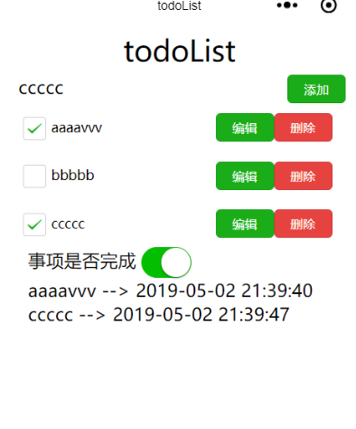
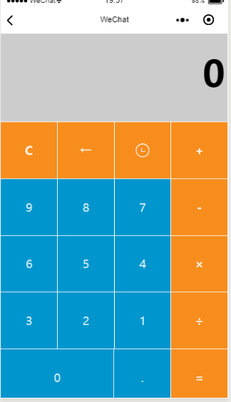

# 微信小程序的一些简单小demo

1. todoList
  功能：  
  * 添加事项
  * 删除事项
  * 编辑事项
  * 查看完成事项和未完成事项
  用到的小程序组件和功能：
  * wx:if 条件渲染
  * wx:for 列表渲染
  * input组件，button组件，switch组件 和 checkbox组件

  效果：   
     

2. 计算器
  功能：
  * 加减乘除，清空，历史纪录    
  用到的小程序组件和功能：
  * wx:if 条件渲染
  * wx:for 列表渲染
  * 事件
  * wx.setStorageSync() 本地存储

效果图：

